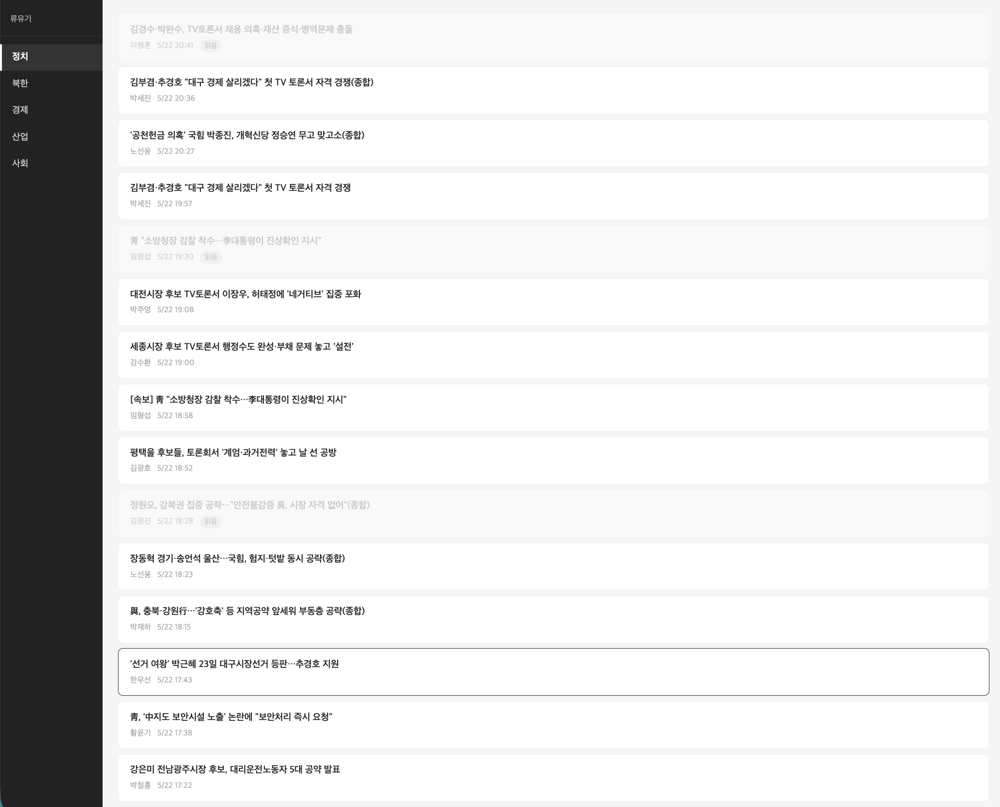
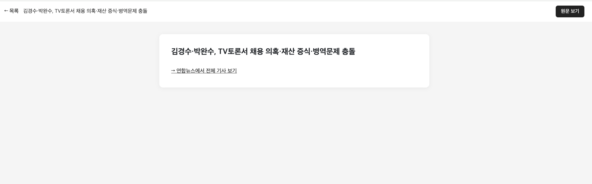

# NewsPush — 뉴스 푸시 알림 서비스

연합뉴스 RSS를 주기적으로 수집하고, 유저의 관심 카테고리에 맞는 기사를 APNs / FCM 방식으로 푸시 발송하는 Spring Boot 기반 백엔드 서비스입니다.  
기사 조회·읽음 처리 API와 이를 사용하는 프론트엔드(Vanilla JS)도 함께 구현했습니다.

---

## 스크린샷

### 사용자 선택


### 기사 목록 (읽음/미읽음 구분)


### 기사 상세


### 원문 보기


---

## 사용 기술

| 분류 | 기술 |
|------|------|
| Language | Java 21 |
| Framework | Spring Boot 3.5 |
| ORM | Spring Data JPA / Hibernate |
| Database | SQLite 3 (파일 기반, 별도 서버 불필요) |
| RSS 파싱 | Rome 1.18 |
| 엑셀 파싱 | Apache POI 5.2 |
| 빌드 | Gradle 8 |
| 프론트엔드 | Vanilla JS + Bootstrap 5 (Static HTML) |

---

## 프로젝트 구조

```
src/main/java/com/newspush/newspush/
├── config/
│   └── AsyncConfig.java          # 비동기/스케줄 설정
├── controller/
│   └── ArticleController.java    # REST API
├── domain/
│   ├── entity/
│   ├── enums/
│   └── repository/
├── dto/
├── loader/
│   └── ExcelDataLoader.java      # 초기 유저 데이터 적재
├── scheduler/
│   └── RssScheduler.java         # RSS 수집 및 푸시 발송 트리거
└── service/
    ├── RssCollector.java          # RSS 파싱
    ├── AsyncPushProcessor.java    # 기사별 푸시 처리
    ├── PushAsyncService.java      # 비동기 푸시 발송
    ├── DndPolicy.java             # 방해금지 시간 정책
    ├── PushNotificationService.java
    └── PushNotificationServiceImpl.java

src/main/resources/
├── static/
│   ├── index.html   # 유저 선택 화면
│   ├── list.html    # 기사 목록 + 읽음 처리
│   └── article.html # 기사 상세
├── users.xlsx
└── application.yaml
```

---

## DB 모델링

```
┌──────────────────┐         ┌──────────────────────┐
│      users       │         │   user_categories    │
├──────────────────┤    1:N  ├──────────────────────┤
│ id (PK)          │────────>│ id (PK)              │
│ name             │         │ user_id (FK)         │
│ device_id        │         │ category (STRING)    │
│ push_type        │         └──────────────────────┘
│ dnd_time         │
└──────────────────┘

┌──────────────────────┐      ┌──────────────────────────────┐
│      articles        │      │      user_article_reads      │
├──────────────────────┤      ├──────────────────────────────┤
│ article_id (PK)      │      │ id (PK)                      │
│ title                │      │ user_id                      │
│ category             │      │ article_id                   │
│ link                 │      │ read_at                      │
│ author               │      │ UNIQUE(user_id, article_id)  │
│ pub_date             │      └──────────────────────────────┘
│ created_at           │
└──────────────────────┘

┌──────────────────────────────────────┐
│               push_logs              │
├──────────────────────────────────────┤
│ id (PK)                              │
│ user_id / device_id / push_type      │
│ article_id / title / category        │
│ status (success / fail)              │
│ fail_reason / sent_at                │
└──────────────────────────────────────┘
```

| 테이블 | 역할 |
|--------|------|
| `users` | 유저 정보 및 푸시 설정 |
| `user_categories` | 유저별 관심 카테고리 |
| `articles` | RSS 수집 기사 (최대 1,000건) |
| `user_article_reads` | 유저별 기사 읽음 이력 |
| `push_logs` | 푸시 발송 성공/실패 이력 |

---

## 실행 방법

```bash
git clone <repo-url>
cd newspush
./gradlew bootRun
```

- Java 21 이상 필요
- 서버 기동 시 `users.xlsx`에서 유저 100명을 자동 적재합니다
- SQLite DB 파일(`app.db`)이 프로젝트 루트에 자동 생성됩니다
- CSV 내보내기 파일은 /data 폴더에 있습니다.
- 실행 결과가 담긴 `app.db` 파일이 프로젝트 루트에 포함되어 있습니다

- RSS는 기동 즉시 수집을 시작하며, 이후 10분마다 자동 수집됩니다
- 최초 실행 직후에는 RSS 수집이 완료되기 전까지 기사 목록 조회 시 빈 화면 또는 오류가 발생할 수 있습니다

### 접속

| 화면 | URL |
|------|-----|
| 유저 선택 | http://localhost:8080 |
| 기사 목록 | http://localhost:8080/list.html |

---

## API 명세

| Method | URL | 설명 |
|--------|-----|------|
| GET | `/api/users` | 유저 목록 (드롭다운용) |
| GET | `/api/categories` | 카테고리 목록 |
| GET | `/api/articles?category={}&userId={}` | 기사 목록 + 읽음 여부 |
| POST | `/api/articles/{articleId}/read?userId={}` | 읽음 처리 |

**기사 목록 응답 예시**
```json
[{
  "articleId": "20250520001234",
  "title": "기사 제목",
  "link": "https://...",
  "author": "홍길동",
  "pubDate": "2025-05-20T09:00:00",
  "read": false
}]
```

---

## 핵심 흐름

```
[RssScheduler - 10분 fixedDelay]
  │
  ├─ 1. 5개 카테고리 병렬 RSS 수집 (CompletableFuture + rssExecutor)
  ├─ 2. 신규 기사 필터링 후 saveAll (UNIQUE 제약으로 중복 방지)
  ├─ 3. 1,000건 초과 시 오래된 기사 삭제 (읽음 이력 먼저 삭제 → 기사 삭제)
  └─ 4. AsyncPushProcessor.process(newArticles)
           └─ 기사별: 매칭 유저 조회 (N+1 방지)
                └─ 유저별: PushAsyncService.send()
                         ├─ DndPolicy.isBlocked() 확인
                         ├─ sendAPNS() / sendFCM()
                         └─ PushLog 저장 (성공/실패 모두)
```

---

## 주요 설계 결정

| 결정 | 이유 |
|------|------|
| `UserArticleRead`에 FK 미적용 | `@ManyToOne` 없이 userId / articleId 값만 참조. 기사 삭제 시 읽음 이력을 코드 레벨에서 먼저 삭제해 정합성 보장. |
| `PushAsyncService` 클래스 분리 | 같은 클래스 내 `@Async` 호출 시 프록시를 거치지 않는 셀프 인보케이션 문제 방지. |
| `DndPolicy` 별도 클래스 분리 | 변경 가능성 있는 비즈니스 규칙을 서비스에서 분리. 자정 넘기는 케이스(`23:00-01:00`)도 처리. |
| `pushExecutor` 스레드 1개 | SQLite의 쓰기 동시성 한계로 인해 멀티스레드 발송 시 `SQLITE_BUSY` 발생. 현재는 순차 처리로 운영하고, 실제 운영 DB(MySQL/PostgreSQL) 환경에서는 확장 가능한 구조로 설계. |
| `sessionStorage`에 userId 저장 | 탭 닫으면 자동 삭제. `localStorage`는 브라우저를 꺼도 남아 유저 혼동 가능성 있음. |
| `pageshow + e.persisted` 처리 | 뒤로가기 시 브라우저 캐시로 복원되면 읽음 상태가 갱신되지 않는 문제 해결. |

---

## 트러블슈팅

### SQLite 동시 쓰기 제한 (SQLITE_BUSY)

**원인**: 멀티스레드 `@Async` 발송 시 여러 스레드가 동시에 `PushLog.save()`를 호출해 lock 충돌.

**시도**: WAL 모드 적용, 커넥션 풀 조정, 스레드 수 축소.

**결론**: SQLite의 쓰기 동시성 한계. `pushExecutor` 스레드를 1개로 제한해 순차 처리. 실제 운영 환경에서는 MySQL/PostgreSQL 사용 권장.

### LazyInitializationException

**원인**: 트랜잭션 종료 후 `UserCategory.user` 지연 로딩 시도.

**해결**:
`@Query("SELECT uc FROM UserCategory uc JOIN FETCH uc.user WHERE uc.category = :category")`
형태의 fetch join 쿼리로 User를 함께 조회하도록 변경.

### DataIntegrityViolationException 제거

**배경**: 멀티스레드 환경의 race condition 방어를 위해 기사 저장 시 `DataIntegrityViolationException` catch로 중복을 처리하는 구조로 설계.

**변경**: SQLite 동시 쓰기 한계로 단일 스레드 처리로 전환하면서, 사전 필터링(`findAllArticleIds`)으로 대체. 실제 운영 DB 환경에서는 원래 설계대로 멀티스레드 + 예외 처리 구조가 동작 가능.

### SQLite pub_date 숫자 저장

**원인**: SQLite에 네이티브 DateTime 타입이 없어 JPA가 epoch 밀리초로 저장.

**현황**: 기능 동작에는 문제 없음. MySQL/PostgreSQL 환경에서는 정상 저장됨.

---

## AI 도구 활용

**Claude (claude.ai)**를 활용해 설계 검토, 트러블슈팅 원인 분석, 프론트엔드 작성을 진행했습니다.
